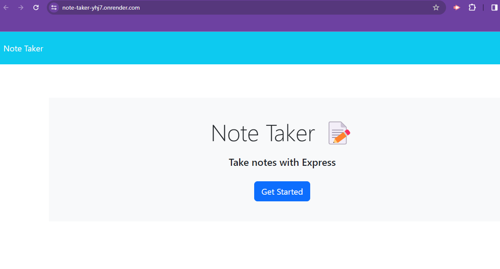

   # Note Taker
   

   ## Description
   
   An app that allows the user to write and save notes.
   
   ## Table of Contents 
   
   1. [Installation](#installation)
   2. [Usage](#usage)
   3. [License](#license)
   4. [How to Contribute](#how-to-contribute)
   5. [Tests](#tests)
   6. [Questions](#questions)
   
   ## Installation
   
   N/A
   
   ## Usage
   
   When the page is open, type in a title and a description for the note and then click save note.

   
   
   ## License
   
   MIT

   ## How to Contribute

   (https://www.contributor-covenant.org/)

   ## Tests

   N/A

   ## Questions

   For any additional questions, please contact me:
   github.com/GwiyomiAmy
   gwiyomiamy@gmail.com
   